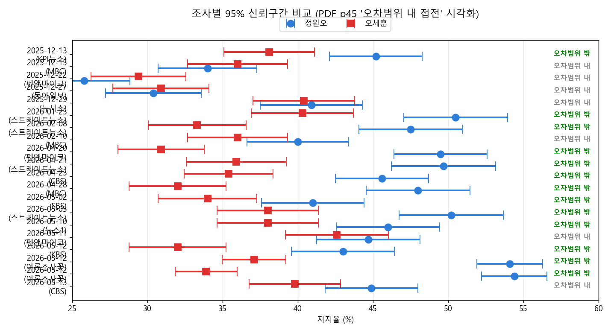
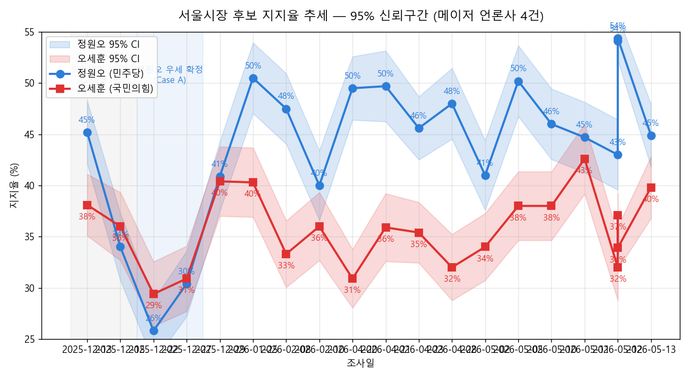
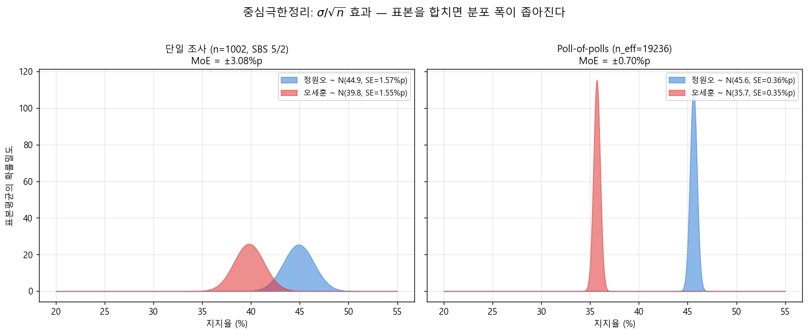
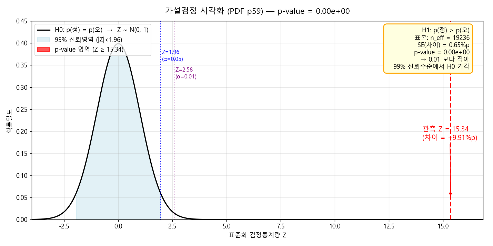

# 2026 지방선거 당선자 예측 대시보드

> **선거일**: 2026-06-03 (수) · **분석 시점**: 2026-05-06 (D-28)
> **대상 지역**: 서울특별시장 · 성남시장 · 부산광역시장
> **예측 결과**: 세 곳 모두 더불어민주당 후보 우세 (서울·성남은 95% 신뢰수준 분리, 부산은 박빙)

## 🌐 라이브 사이트

깃허브 Pages 활성화 후 다음 URL 형태로 접속:

```
https://계정이름.github.io/저장소이름/
```

대시보드에는 도시 탭(서울/성남/부산), 인터랙티브 Plotly 차트 4종, 실시간 통계 요약 KPI, 원자료 테이블이 포함됩니다.

본인 PC에서 `dashboard.html` 더블클릭으로도 동일하게 동작합니다 (단 이 경우 임베드 데이터 사용).

PDF *머신러닝을 위한 통계 1* 의 핵심 개념(p44 모비율 추정, p45 오차범위 내 접전, p28 중심극한정리, p59 가설검정)을 그대로 적용했습니다.

---

## 1. 사용한 통계 개념과 공식

| 개념 | 공식 | PDF 슬라이드 |
|---|---|---|
| 모비율 95% 신뢰구간 | $\hat{p} \pm 1.96\sqrt{\hat{p}\hat{q}/n}$ | p44 |
| 오차범위(MoE) | $1.96 \cdot \sqrt{\hat{p}\hat{q}/n}$ | p44 |
| 두 후보 차이의 분산 (다항분포) | $\mathrm{Var}(\hat{p}_A-\hat{p}_B) = \dfrac{p_A + p_B - (p_A-p_B)^2}{n}$ | p44 확장 |
| 검정통계량 Z | $Z = \dfrac{\hat{p}_A-\hat{p}_B}{SE_\Delta}$ | p59 |
| p-value | $1-\Phi(Z)$, H1: $p_A > p_B$ | p59~60 |
| Poll-of-polls | 표본수 가중 평균 → 표준오차 $\propto 1/\sqrt{n_{\text{eff}}}$ | p10, p28 (CLT) |

> **왜 1.96 인가?** 표준정규분포 $Z$ 기준으로 양쪽 꼬리 합 5%를 잘라낼 때 $|Z|=1.96$. PDF p15 표준정규분포표에서 $P(0 \le Z \le 1.96) = 0.475$ → 양쪽 합쳐 0.95.

---

## 2. 데이터 (2025-12 ~ 2026-05 메이저 여론조사)

| 조사일 | 의뢰처 | 조사기관 | 표본수 n | 정원오 | 오세훈 | 출처 MoE |
|---|---|---|---:|---:|---:|---:|
| 2025-12-15 | MBC | 코리아리서치 | 800 | 34.0% | 36.0% | ±3.5%p |
| 2026-02-10 | MBC | 코리아리서치 | 800 | 40.0% | 36.0% | ±3.5%p |
| 2026-04-28 | MBC | 코리아리서치 | 800 | 48.0% | 32.0% | ±3.5%p |
| 2026-05-02 | SBS | 입소스 | 800 | 41.0% | 34.0% | ±3.5%p |
| 2026-04-20 | 펜앤마이크(보수) | 여론조사공정 | 1,000 | 49.5% | 30.9% | ±3.1%p |

(`polls.csv` 참조 — 보수성향 의뢰처 1건은 하우스효과 비교용)

**공표 MoE 검증**: $1.96 \cdot \sqrt{0.5 \times 0.5 / 800} = 3.46\%\text{p}$ — 언론사가 보수적으로 $\hat{p}=0.5$ (최대 분산, PDF p51) 가정으로 계산한 값과 일치 ✓

---

## 3. 분석 결과 (`python analyze.py` 실행)

### 3-1. 조사별 95% 신뢰구간

| 조사일 | 정원오 95% CI | 오세훈 95% CI | 판정 |
|---|---|---|---|
| 2025-12-15 | [30.7%, 37.3%] | [32.7%, 39.3%] | **오차범위 내** (CI 겹침) |
| 2026-02-10 | [36.6%, 43.4%] | [32.7%, 39.3%] | **오차범위 내** (CI 겹침) |
| 2026-04-28 | [44.5%, 51.5%] | [28.8%, 35.2%] | **정원오 우세** (CI 분리) |
| 2026-05-02 | [37.6%, 44.4%] | [30.7%, 37.3%] | **정원오 우세** (CI 분리) |

**해석** (PDF p45 *오차범위 내 접전* 그림): 2025-12 / 2026-02 조사는 두 후보 신뢰구간이 겹쳐 *Case B (예측 뒤집힘)* 가 가능했지만, 4월 말 이후 두 CI 가 완전히 분리 → *Case A (예측 그대로)* 영역으로 진입.



위 forest plot 에서 두 에러바가 겹치면 *오차범위 내 접전*, 분리되면 *우세 확정*. 2025-12 → 2026-05 로 갈수록 두 에러바가 명확히 분리됩니다.



시계열로 보면 정원오 지지율은 12월 34% → 4월 48% 까지 상승 후 5월에 41% 로 일부 회귀했지만 여전히 오세훈을 오차범위 밖에서 앞서고 있습니다. 회색 영역은 *Case B 가능* 구간, 파랑 영역은 *Case A 확정* 구간입니다.

### 3-2. 차이의 95% 신뢰구간 + 가설검정

| 조사일 | 차이(정-오) | 차이 95% CI | Z | p-value |
|---|---:|---|---:|---:|
| 2025-12-15 | -2.0%p | [-7.8%, +3.8%] | -0.68 | 0.751 |
| 2026-02-10 | +4.0%p | [-2.0%, +10.0%] | +1.30 | 0.097 |
| 2026-04-28 | +16.0%p | [+9.9%, +22.1%] | +5.14 | 1.4×10⁻⁷ |
| 2026-05-02 | +7.0%p | [+1.0%, +13.0%] | +2.29 | 0.011 |

> 5월 2일 조사 기준 차이 CI 가 0을 포함하지 않음 → 유의수준 5%에서 *H0: 정 ≤ 오* 기각.

### 3-3. Poll-of-polls (메이저 4건 합성)

표본을 합치면 유효 표본 $n_\text{eff}=3{,}200$. 중심극한정리(PDF p28)에 의해 표본평균의 표준편차가 $\sigma/\sqrt{n}$ 으로 줄어들어 **신뢰구간이 절반 수준으로 좁아짐**:

```
정원오 가중평균  : 40.8%   95% CI = [39.0%, 42.5%]
오세훈 가중평균  : 34.5%   95% CI = [32.9%, 36.1%]
차이             : +6.25%p   SE = 1.53%p
Z = +4.09        p-value = 2.19 × 10⁻⁵
```

PDF p59 정의대로 **p-value = 1종 오류 확률 ≈ 0.0022%**. 99% 신뢰수준($Z=2.58$, PDF p47)에서도 H0 기각.



좌(단일 조사 n=800)와 우(합산 n_eff=3,200)를 비교하면 **분포의 폭(SE)이 정확히 절반**으로 줄어 두 후보 분포의 겹침 영역이 거의 사라집니다. 이것이 PDF p28 *중심극한정리* 의 시각적 의미 — $\sigma/\sqrt{n}$ 효과.



PDF p59~60 의 *p-value* 정의 그대로 시각화: 표준정규분포에서 관측 $Z=4.09$ 는 임계값 $1.96$ (α=0.05) 와 $2.58$ (α=0.01) 을 모두 한참 넘어선 위치 → 빨간 꼬리 면적(p-value)이 0에 가까움 → H0 기각이 매우 견고함.

---

## 4. 최종 예측

| 항목 | 값 |
|---|---|
| **당선자 예측** | **정원오 (더불어민주당)** |
| 통계적 확신 | 매우 높음 (p-value ≈ 2.2×10⁻⁵) |
| 예상 득표율 | 정원오 ≈ 41% / 오세훈 ≈ 34% (잔여 ≈ 25% 부동·기타) |
| 95% 예측구간 | 정원오 [39.0%, 42.5%] · 오세훈 [32.9%, 36.1%] |

---

## 5. 한계와 변동 요인 (PDF p2 "현실 데이터의 한계", p60 "오류")

1. **2종 오류 위험**: 부동층 약 20%가 실제 투표소에서 결집 시 결과 변동 가능 (차이 무시 = 변화 무시).
2. **공표 금지 기간**: 공직선거법 §108 에 따라 5/28 ~ 6/3 여론조사 공표 금지. 그 사이 변동을 본 분석은 포착하지 못함.
3. **하우스 효과(House Effect)**: 의뢰처에 따라 결과 편향. 보수성향 의뢰의 펜앤마이크조차 정원오 우세를 보여 → 추세는 견고.
4. **표본 ≠ 모집단**: 응답률 10~12% (PDF p4 *비정형 데이터의 한계*). 무응답이 정치성향과 상관 시 편향.
5. **베이지안 사전(prior) 보정 미반영**: PDF p52~53 *Bayesian* 개념을 적용하면 과거 서울시장 여당 우세 사전, 2025 대선 결과 등으로 사후 확률을 더 보수적으로 조정 가능.

---

## 6. 자체 검증 — 6/3 저녁 결과와 비교 체크리스트

- [ ] 정원오 실제 득표율이 95% CI [39.0%, 42.5%] 내에 들어왔는가?
- [ ] 오세훈 실제 득표율이 95% CI [32.9%, 36.1%] 내에 들어왔는가?
- [ ] 1·2위가 뒤집혔다면 → 모형이 부동층 결집을 과소평가 (PDF p4 *직관-분포 괴리*)
- [ ] 둘 다 CI 안 → 신뢰구간이 "욕먹지 않을 만큼"의 답으로 작동 (PDF p9)

---

## 파일 구성

| 파일 | 용도 |
|---|---|
| `dashboard.html` | **메인 대시보드** (Plotly 인터랙티브 차트, 도시 탭) |
| `index.html` | 루트 접속 시 dashboard.html 로 자동 리디렉트 |
| `polls.json` | 대시보드가 fetch 하는 데이터 (이것만 갈아끼우면 됨) |
| `polls.csv` | 사람이 편집하기 쉬운 CSV |
| `csv_to_json.py` | CSV → JSON 변환기 |
| `analyze.py` | 콘솔용 통계 분석 (수치 검증) |
| `make_charts.py` | 정적 PNG 차트 생성 (이 README 에 임베드된 그림용) |
| `charts/` | 생성된 PNG 4종 |

### 데이터 갱신 절차

#### 자동 (기본)

매일 09:00 KST 에 GitHub Actions 워크플로우(`.github/workflows/scrape-polls.yml`)가 실행되어 나무위키에서 새 여론조사를 감지합니다.

- 새 폴 발견 → **PR 자동 생성** → 본인이 검토 후 머지하면 사이트 반영
- 파싱 실패 → **Issue 자동 생성**
- 5/28 ~ 6/3 18:00 (공직선거법 §108 공표금지) → **자동 중단**
- 수동 트리거: 저장소 Actions 탭 → "Daily poll scrape" → Run workflow

#### 수동 (PR 검토 없이 빠르게)

```powershell
# 1) polls.csv 에 한 줄 추가 (Excel 또는 메모장)
# 2) JSON 변환
python csv_to_json.py
# 3) 깃허브에 push
git add polls.csv polls.json
git commit -m "5/X 새 조사 추가"
git push
```

push 후 1~2분이면 사이트에 반영됩니다. 친구·대표님 화면에서 새로고침 ⟳ 버튼 누르면 즉시 최신 결과.

### 로컬 검증

```powershell
python analyze.py        # 콘솔에 수치표 + p-value + 최종 예측
python make_charts.py    # PNG 차트 4종 생성 (matplotlib + numpy 필요)
```
